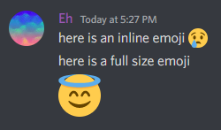

# EmojiBot 
A Discord bot that reacts to messages with inline emojis that coincidentally appear small and are inferior to the large emojis.

## Overview
I made this bot a few years back because one particular Discord user in a server I frequented would always write messages with inline emojis. This aggravated me to no end as I had to strain my eyes to see the details of the emoji. Therefore, this bot was made to humiliate the small emoji senders in this world by reacting to their messages, that contain small emojis, with a playful string of emojis that spell out a message.

Ironically, the emojis the bot reacts with are even smaller than the small emoji perpetrator's...

## Showcase
\
The difference in size between an inline emoji and a plain emoji

\
The product of the bot's reactions